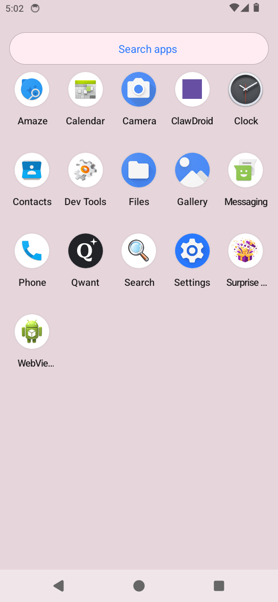

# ClawDroid

Run [PicoClaw](https://github.com/sipeed/picoclaw) — an ultra-lightweight, private AI assistant — natively on Android. ClawDroid bundles a static ARM64 PicoClaw binary and a Termux bootstrap to provide a fully containerized terminal environment, all within a single APK.

## Features

- **PicoClaw Integration** — Bundled static Go binary, extracted and launched on-device
- **Termux Bootstrap** — Self-hosted Proot environment downloaded on first launch
- **Mission Control** — Local web dashboard served via NanoHTTPD
- **Agent Chat** — Native chat UI for interacting with PicoClaw's AI
- **Provider Management** — Add/configure multiple AI model providers
- **Terminal Emulator** — Embedded Termux session for direct CLI access
- **Status Dashboard** — Real-time health indicators for bootstrap, PicoClaw process, and server

## Screenshots

| Main Dashboard | Chat Interface |
|---|---|
|  |  |

## Requirements

- **Android API 26+** (Android 8.0 Oreo)
- **ARM64** device or emulator (primary target)
- ~200MB free space (Termux bootstrap)

## Quick Start

```bash
# Build debug APK
make build-debug

# Install on connected emulator/device
make adb-install
```

## Development

All build commands run inside a Docker container. See [AGENTS.md](AGENTS.md) for full details.

```bash
# Start build container
make up

# Build
make build-debug        # assembleDebug APK
make build-release      # assembleRelease APK
make clean              # clean build artifacts

# Test
make test-unit          # JUnit unit tests
make test-e2e           # Espresso acceptance tests (15 BDD tests)
make test-all           # unit + integration

# Lint
make lint
make quality-check      # lint + test + assembleDebug

# Emulator
make adb-find           # auto-discover emulator on network
make adb-connect IP=x   # connect to specific emulator
make adb-install        # build + install on emulator

# PicoClaw binary
make build-picoclaw     # rebuild PicoClaw from source
```

### Project Structure

```
app/src/main/java/com/example/clawdroid/
├── App.kt                     # Application class, bootstrap logic
├── MainActivity.kt            # Dashboard with status chips
├── AgentChatActivity.kt       # Native chat with PicoClaw
├── MissionControlActivity.kt  # WebView for Mission Control
├── LogViewerActivity.kt       # PicoClaw log viewer
├── ProviderListActivity.kt    # AI provider configuration
├── config/                    # Config UI and ViewModel
├── model/                     # Data models (ChatMessage, ModelProvider, etc.)
├── server/                    # NanoHTTPD mission control server
└── terminal/                  # Termux bootstrap, session, process management
```

## Architecture

ClawDroid uses the standard Android MVVM pattern with `Application`-scoped singletons:

- **`App.kt`** — Manages Termux bootstrap lifecycle, PicoClaw binary extraction, and provides app-wide coroutine scope
- **`TermuxBootstrapManager`** — Downloads, verifies, and extracts the Termux Proot bootstrap into the app's private data directory
- **`TerminalManager`** — Launches/manages the embedded Termux session running PicoClaw
- **`ServerManager`** — Starts/stops the local NanoHTTPD mission control web server
- **`ProcessMonitor`** — Polls process status and exposes it as a `StateFlow`

## Testing

- **Unit tests**: JUnit 4 + Mockito at `app/src/test/`
- **Acceptance tests**: 15 BDD scenarios (Espresso) at `app/src/androidTest/`
- **Coverage**: App launch, config, server, and terminal scenarios

## License

See [LICENSE](LICENSE).
